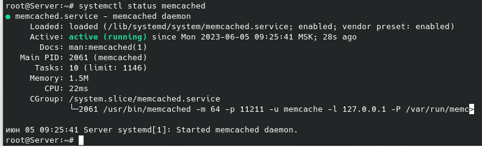
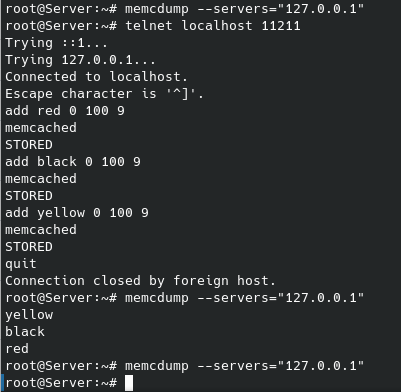
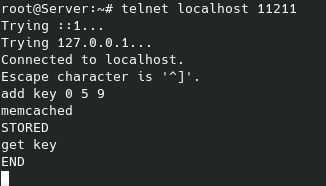
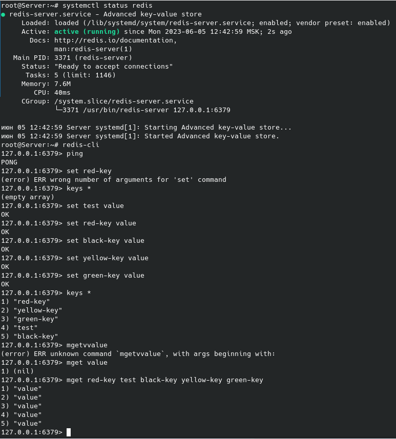

# Домашнее задание к занятию 11.2. Кеширование Redis/memcached - Рыбакин Алексей

### Задание 1. Кеширование 
Приведите примеры проблем, которые может решить кеширование. 
*Приведите ответ в свободной форме.*
---
Кэширование - решает проблему медленного вывода информации, сокращают задержки при передачи данных,помогают экономить трафик. Уменьшают время обработки данных за счет сохраненной информации в кэше. Уменьшается время работы с одинаковыми данными сервиса если работают несколько подключений (компьютеров). Не теряются временно введенные данные (при регистрации)

### Задание 2. Memcached
Установите и запустите memcached.
*Приведите скриншот systemctl status memcached, где будет видно, что memcached запущен.*
---

### Задание 3. Удаление по TTL в Memcached
Запишите в memcached несколько ключей с любыми именами и значениями, для которых выставлен TTL 5. 
*Приведите скриншот, на котором видно, что спустя 5 секунд ключи удалились из базы.*
---
Успеть за 5 сек записать несколько ключей, проверить их и потом вывести с разницей "до" и "после". Просто физчески не успею. Сделал с временем жизни кеша 100 сек.

Вот примет с 5-ю секундами

### Задание 4. Запись данных в Redis
Запишите в Redis несколько ключей с любыми именами и значениями. 
*Через redis-cli достаньте все записанные ключи и значения из базы, приведите скриншот этой операции.*

