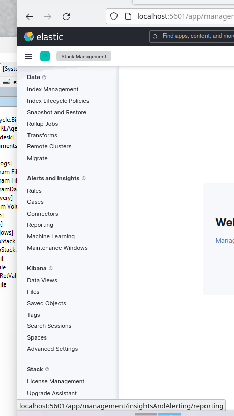

# Домашнее задание к занятию 11.3. «ELK» - Рыбакин Алексей

### Задание 1. Elasticsearch 

Установите и запустите Elasticsearch, после чего поменяйте параметр cluster_name на случайный. 

*Приведите скриншот команды 'curl -X GET 'localhost:9200/_cluster/health?pretty', сделанной на сервере с установленным Elasticsearch. Где будет виден нестандартный cluster_name*.

---

### Задание 2. Kibana

Установите и запустите Kibana.

*Приведите скриншот интерфейса Kibana на странице http://<ip вашего сервера>:5601/app/dev_tools#/console, где будет выполнен запрос GET /_cluster/health?pretty*.

---

### Задание 3. Logstash

Установите и запустите Logstash и Nginx. С помощью Logstash отправьте access-лог Nginx в Elasticsearch. 

*Приведите скриншот интерфейса Kibana, на котором видны логи Nginx.*

Есть сложность

<details>
<summary>Файл /etc/logstash/conf.d/logstash.conf</summary>


```
input {
        file {
                path => "/var/log/nginx/access.log"
                start_position => "beginning"
                type => "nginx"
}
}
filter {
        grok {
                match => { "message" => "%{IPORHOST:remote_ip} - %{DATA:user_name} \[%{HTTPDATE:access_time}\] \"%{WO>
        mutate {
                remove_field => [ "host" ]
        }
}
output {
        elasticsearch {
                hosts => localhost
#               data_stream => "true"
                index => "nginx-%{+YYYY.MM.dd}"
        }
}

```
</details>


Версия elasticsearch, kibana, logstash - 8.9.0

После всего установленного не появляется "index-pattern" 



---

### Задание 4. Filebeat. 

Установите и запустите Filebeat. Переключите поставку логов Nginx с Logstash на Filebeat. 

*Приведите скриншот интерфейса Kibana, на котором видны логи Nginx, которые были отправлены через Filebeat.*

