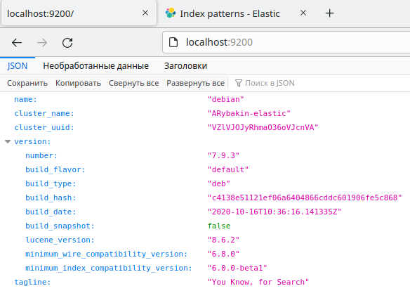
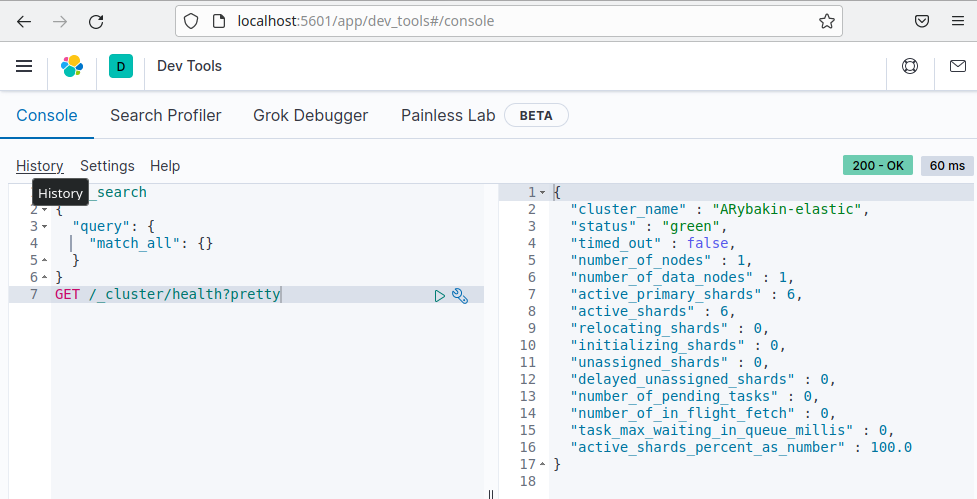
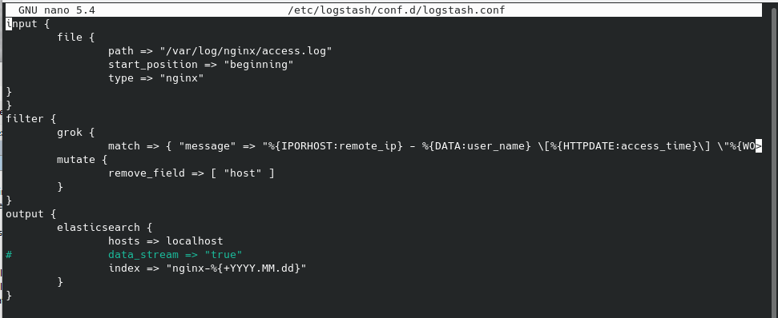

# Домашнее задание к занятию 11.3. «ELK» - Рыбакин Алексей

Подготовка:

Созданно на VirtualBox:
1. Debian11. В нём установлен apt-transport-https Elasticsearch 7.9.3 и Kibana 7.9.3 с настройками указанными ниже. ip 192.168.56.108
2. Debian11. Уустановленно apt-transport-https nginx и Logstash 7.9.3. ip 192.168.56.110


### Задание 1. Elasticsearch 

Установите и запустите Elasticsearch, после чего поменяйте параметр cluster_name на случайный. 

*Приведите скриншот команды 'curl -X GET 'localhost:9200/_cluster/health?pretty', сделанной на сервере с установленным Elasticsearch. Где будет виден нестандартный cluster_name*.



<details>
<summary>файл /etc/elasticsearch/elasticsearch.yml</summary>

```
luster.name: ARybakin-elastic
node.name: 192.168.56.108
path.data: /var/lib/elasticsearch
path.logs: /var/log/elasticsearch
network.host: 0.0.0.0
discovery.seed_hosts: ["192.168.56.108", "192.168.56.110"]
cluster.initial_master_nodes: ["192.168.56.108", "192.168.56.110"]

```
</details>

При всех этих настройках elastik вроде нормально выводит информацию.  

<details>
<summary>curl -X GET 'localhost:9200/_cluster/health?pretty'</summary>

```
{
  "cluster_name" : "ARybakin-elastic",
  "status" : "green",
  "timed_out" : false,
  "number_of_nodes" : 1,
  "number_of_data_nodes" : 1,
  "active_primary_shards" : 6,
  "active_shards" : 6,
  "relocating_shards" : 0,
  "initializing_shards" : 0,
  "unassigned_shards" : 0,
  "delayed_unassigned_shards" : 0,
  "number_of_pending_tasks" : 0,
  "number_of_in_flight_fetch" : 0,
  "task_max_waiting_in_queue_millis" : 0,
  "active_shards_percent_as_number" : 100.0
}

```
</details>

<details>
<summary>journalctl -u elasticsearch</summary>

```
сен 20 08:35:12 debian systemd[1]: Starting Elasticsearch...
сен 20 08:35:41 debian systemd[1]: Started Elasticsearch.
сен 20 13:28:53 debian systemd[1]: Stopping Elasticsearch...
сен 20 13:28:53 debian systemd[1]: elasticsearch.service: Succeeded.
сен 20 13:28:53 debian systemd[1]: Stopped Elasticsearch.
сен 20 13:28:53 debian systemd[1]: elasticsearch.service: Consumed 3min 35.565s CPU time.
сен 20 13:28:53 debian systemd[1]: Starting Elasticsearch...
сен 20 13:29:08 debian systemd[1]: Started Elasticsearch.
сен 20 14:21:22 debian systemd[1]: Stopping Elasticsearch...
сен 20 14:21:23 debian systemd[1]: elasticsearch.service: Succeeded.
сен 20 14:21:23 debian systemd[1]: Stopped Elasticsearch.
сен 20 14:21:23 debian systemd[1]: elasticsearch.service: Consumed 1min 39.439s CPU time.
сен 20 14:22:01 debian systemd[1]: Starting Elasticsearch...
сен 20 14:22:15 debian systemd[1]: Started Elasticsearch.
сен 20 14:23:38 debian systemd[1]: Stopping Elasticsearch...
сен 20 14:23:39 debian systemd[1]: elasticsearch.service: Succeeded.
сен 20 14:23:39 debian systemd[1]: Stopped Elasticsearch.
сен 20 14:23:39 debian systemd[1]: elasticsearch.service: Consumed 35.838s CPU time.
сен 20 14:24:36 debian systemd[1]: Starting Elasticsearch...
сен 20 14:25:00 debian systemd[1]: Started Elasticsearch.
сен 20 14:35:27 debian systemd[1]: Stopping Elasticsearch...
сен 20 14:35:28 debian systemd[1]: elasticsearch.service: Succeeded.
сен 20 14:35:28 debian systemd[1]: Stopped Elasticsearch.
сен 20 14:35:28 debian systemd[1]: elasticsearch.service: Consumed 52.345s CPU time.
сен 20 14:35:52 debian systemd[1]: Starting Elasticsearch...
сен 20 14:36:07 debian systemd[1]: Started Elasticsearch.

```
</details>

---
### Задание 2. Kibana

Установите и запустите Kibana.

*Приведите скриншот интерфейса Kibana на странице http://<ip вашего сервера>:5601/app/dev_tools#/console, где будет выполнен запрос GET /_cluster/health?pretty*.



<details>
<summary>файл /etc/kibana/kibana.yml </summary>

```
server.host: "0.0.0.0"
server.name: "localhost"
elasticsearch.hosts: ["http://192.168.56.108:9200", "http://192.168.56.110:9200"]

```
</details>

Так же и Kibana, при этих настройках выводит свою информацию.
И прокидывается на браузер Windows по адрессу 192.168.56.108:5601

<details>
<summary>kibana.service - Kibana</summary>

```
    Loaded: loaded (/etc/systemd/system/kibana.service; enabled; vendor preset: enabled)
     Active: active (running) since Wed 2023-09-20 14:31:36 MSK; 1h 24min ago
   Main PID: 5299 (node)
      Tasks: 11 (limit: 9508)
     Memory: 664.8M
        CPU: 54.055s
     CGroup: /system.slice/kibana.service
             └─5299 /usr/share/kibana/bin/../node/bin/node /usr/share/kibana/bin/../src/cli

сен 20 15:39:22 debian kibana[5299]: {"type":"response","@timestamp":"2023-09-20T12:39:22Z","tags":[],"pid":5299,"meth>
сен 20 15:39:23 debian kibana[5299]: {"type":"response","@timestamp":"2023-09-20T12:39:23Z","tags":[],"pid":5299,"meth>
сен 20 15:39:23 debian kibana[5299]: {"type":"response","@timestamp":"2023-09-20T12:39:23Z","tags":[],"pid":5299,"meth>
сен 20 15:39:23 debian kibana[5299]: {"type":"response","@timestamp":"2023-09-20T12:39:23Z","tags":[],"pid":5299,"meth>
сен 20 15:39:23 debian kibana[5299]: {"type":"response","@timestamp":"2023-09-20T12:39:23Z","tags":[],"pid":5299,"meth>
сен 20 15:39:24 debian kibana[5299]: {"type":"response","@timestamp":"2023-09-20T12:39:24Z","tags":[],"pid":5299,"meth>
сен 20 15:39:24 debian kibana[5299]: {"type":"response","@timestamp":"2023-09-20T12:39:24Z","tags":[],"pid":5299,"meth>
сен 20 15:39:24 debian kibana[5299]: {"type":"response","@timestamp":"2023-09-20T12:39:24Z","tags":[],"pid":5299,"meth>
сен 20 15:39:24 debian kibana[5299]: {"type":"response","@timestamp":"2023-09-20T12:39:24Z","tags":[],"pid":5299,"meth>
сен 20 15:40:54 debian kibana[5299]: {"type":"response","@timestamp":"2023-09-20T12:40:53Z","tags":[],"pid":5299,"meth>
```
</details>

<details>
<summary>journalctl -u kibana</summary>

```
сен 20 14:37:58 debian kibana[5299]: {"type":"response","@timestamp":"2023-09-20T11:37:58Z","tags":[],"pid":5299,"meth>
сен 20 14:39:06 debian kibana[5299]: {"type":"response","@timestamp":"2023-09-20T11:39:05Z","tags":[],"pid":5299,"meth>
сен 20 14:52:55 debian kibana[5299]: {"type":"response","@timestamp":"2023-09-20T11:52:55Z","tags":[],"pid":5299,"meth>
сен 20 14:52:55 debian kibana[5299]: {"type":"response","@timestamp":"2023-09-20T11:52:55Z","tags":["api"],"pid":5299,>
сен 20 14:52:55 debian kibana[5299]: {"type":"response","@timestamp":"2023-09-20T11:52:55Z","tags":[],"pid":5299,"meth>
сен 20 14:52:56 debian kibana[5299]: {"type":"response","@timestamp":"2023-09-20T11:52:56Z","tags":[],"pid":5299,"meth>
сен 20 14:52:56 debian kibana[5299]: {"type":"response","@timestamp":"2023-09-20T11:52:56Z","tags":[],"pid":5299,"meth>
сен 20 14:52:56 debian kibana[5299]: {"type":"response","@timestamp":"2023-09-20T11:52:56Z","tags":[],"pid":5299,"meth>
сен 20 14:52:57 debian kibana[5299]: {"type":"response","@timestamp":"2023-09-20T11:52:57Z","tags":[],"pid":5299,"meth>
сен 20 14:52:57 debian kibana[5299]: {"type":"response","@timestamp":"2023-09-20T11:52:57Z","tags":[],"pid":5299,"meth>
сен 20 14:52:57 debian kibana[5299]: {"type":"response","@timestamp":"2023-09-20T11:52:57Z","tags":[],"pid":5299,"meth>
сен 20 14:52:57 debian kibana[5299]: {"type":"response","@timestamp":"2023-09-20T11:52:57Z","tags":[],"pid":5299,"meth>
сен 20 14:52:57 debian kibana[5299]: {"type":"response","@timestamp":"2023-09-20T11:52:57Z","tags":[],"pid":5299,"meth>
сен 20 14:52:57 debian kibana[5299]: {"type":"response","@timestamp":"2023-09-20T11:52:57Z","tags":[],"pid":5299,"meth>
сен 20 14:52:58 debian kibana[5299]: {"type":"response","@timestamp":"2023-09-20T11:52:58Z","tags":[],"pid":5299,"meth>
сен 20 14:52:58 debian kibana[5299]: {"type":"response","@timestamp":"2023-09-20T11:52:58Z","tags":[],"pid":5299,"meth>
сен 20 14:52:58 debian kibana[5299]: {"type":"response","@timestamp":"2023-09-20T11:52:58Z","tags":[],"pid":5299,"meth>
сен 20 14:52:58 debian kibana[5299]: {"type":"response","@timestamp":"2023-09-20T11:52:58Z","tags":[],"pid":5299,"meth>
сен 20 14:52:58 debian kibana[5299]: {"type":"response","@timestamp":"2023-09-20T11:52:58Z","tags":[],"pid":5299,"meth>
сен 20 14:53:03 debian kibana[5299]: {"type":"response","@timestamp":"2023-09-20T11:53:03Z","tags":[],"pid":5299,"meth>
сен 20 14:53:03 debian kibana[5299]: {"type":"response","@timestamp":"2023-09-20T11:53:03Z","tags":[],"pid":5299,"meth>
сен 20 14:53:03 debian kibana[5299]: {"type":"response","@timestamp":"2023-09-20T11:53:03Z","tags":[],"pid":5299,"meth>
сен 20 14:53:03 debian kibana[5299]: {"type":"response","@timestamp":"2023-09-20T11:53:03Z","tags":[],"pid":5299,"meth>
сен 20 14:53:14 debian kibana[5299]: {"type":"response","@timestamp":"2023-09-20T11:53:14Z","tags":[],"pid":5299,"meth>
сен 20 14:53:14 debian kibana[5299]: {"type":"response","@timestamp":"2023-09-20T11:53:14Z","tags":[],"pid":5299,"meth>
сен 20 14:53:14 debian kibana[5299]: {"type":"response","@timestamp":"2023-09-20T11:53:14Z","tags":[],"pid":5299,"meth>
сен 20 14:53:14 debian kibana[5299]: {"type":"response","@timestamp":"2023-09-20T11:53:14Z","tags":[],"pid":5299,"meth>
сен 20 14:53:14 debian kibana[5299]: {"type":"response","@timestamp":"2023-09-20T11:53:14Z","tags":[],"pid":5299,"meth>
сен 20 14:53:14 debian kibana[5299]: {"type":"response","@timestamp":"2023-09-20T11:53:14Z","tags":[],"pid":5299,"meth>
сен 20 14:53:14 debian kibana[5299]: {"type":"response","@timestamp":"2023-09-20T11:53:14Z","tags":[],"pid":5299,"meth>
сен 20 14:53:18 debian kibana[5299]: {"type":"response","@timestamp":"2023-09-20T11:53:18Z","tags":[],"pid":5299,"meth>
сен 20 14:53:18 debian kibana[5299]: {"type":"response","@timestamp":"2023-09-20T11:53:18Z","tags":[],"pid":5299,"meth>
сен 20 14:53:18 debian kibana[5299]: {"type":"response","@timestamp":"2023-09-20T11:53:18Z","tags":[],"pid":5299,"meth>
сен 20 14:53:18 debian kibana[5299]: {"type":"response","@timestamp":"2023-09-20T11:53:18Z","tags":[],"pid":5299,"meth>
сен 20 14:53:26 debian kibana[5299]: {"type":"response","@timestamp":"2023-09-20T11:53:25Z","tags":[],"pid":5299,"meth>
сен 20 14:53:26 debian kibana[5299]: {"type":"response","@timestamp":"2023-09-20T11:53:26Z","tags":[],"pid":5299,"meth>
сен 20 14:53:26 debian kibana[5299]: {"type":"response","@timestamp":"2023-09-20T11:53:26Z","tags":[],"pid":5299,"meth>
сен 20 14:53:26 debian kibana[5299]: {"type":"response","@timestamp":"2023-09-20T11:53:26Z","tags":[],"pid":5299,"meth>
сен 20 14:53:26 debian kibana[5299]: {"type":"response","@timestamp":"2023-09-20T11:53:26Z","tags":[],"pid":5299,"meth>
сен 20 14:53:28 debian kibana[5299]: {"type":"response","@timestamp":"2023-09-20T11:53:28Z","tags":[],"pid":5299,"meth>
сен 20 14:53:28 debian kibana[5299]: {"type":"response","@timestamp":"2023-09-20T11:53:28Z","tags":[],"pid":5299,"meth>
сен 20 14:53:28 debian kibana[5299]: {"type":"response","@timestamp":"2023-09-20T11:53:28Z","tags":[],"pid":5299,"meth>
сен 20 14:53:30 debian kibana[5299]: {"type":"response","@timestamp":"2023-09-20T11:53:30Z","tags":[],"pid":5299,"meth>
сен 20 14:53:30 debian kibana[5299]: {"type":"response","@timestamp":"2023-09-20T11:53:30Z","tags":[],"pid":5299,"meth>
сен 20 14:53:30 debian kibana[5299]: {"type":"response","@timestamp":"2023-09-20T11:53:30Z","tags":[],"pid":5299,"meth>
сен 20 14:53:36 debian kibana[5299]: {"type":"response","@timestamp":"2023-09-20T11:53:35Z","tags":[],"pid":5299,"meth>
сен 20 14:53:53 debian kibana[5299]: {"type":"response","@timestamp":"2023-09-20T11:53:53Z","tags":[],"pid":5299,"meth>
сен 20 14:53:53 debian kibana[5299]: {"type":"response","@timestamp":"2023-09-20T11:53:53Z","tags":[],"pid":5299,"meth>
сен 20 14:53:53 debian kibana[5299]: {"type":"response","@timestamp":"2023-09-20T11:53:53Z","tags":[],"pid":5299,"meth>
сен 20 14:53:54 debian kibana[5299]: {"type":"response","@timestamp":"2023-09-20T11:53:54Z","tags":[],"pid":5299,"meth>
сен 20 14:54:05 debian kibana[5299]: {"type":"response","@timestamp":"2023-09-20T11:54:05Z","tags":[],"pid":5299,"meth>
сен 20 14:54:06 debian kibana[5299]: {"type":"response","@timestamp":"2023-09-20T11:54:06Z","tags":[],"pid":5299,"meth>
сен 20 14:54:06 debian kibana[5299]: {"type":"response","@timestamp":"2023-09-20T11:54:06Z","tags":[],"pid":5299,"meth>
сен 20 14:54:06 debian kibana[5299]: {"type":"response","@timestamp":"2023-09-20T11:54:06Z","tags":[],"pid":5299,"meth>
сен 20 14:54:13 debian kibana[5299]: {"type":"response","@timestamp":"2023-09-20T11:54:13Z","tags":[],"pid":5299,"meth>
сен 20 14:54:18 debian kibana[5299]: {"type":"response","@timestamp":"2023-09-20T11:54:18Z","tags":[],"pid":5299,"meth>
сен 20 14:54:18 debian kibana[5299]: {"type":"response","@timestamp":"2023-09-20T11:54:18Z","tags":[],"pid":5299,"meth>
сен 20 14:54:18 debian kibana[5299]: {"type":"response","@timestamp":"2023-09-20T11:54:18Z","tags":[],"pid":5299,"meth>
сен 20 14:54:18 debian kibana[5299]: {"type":"log","@timestamp":"2023-09-20T11:54:18Z","tags":["error","elasticsearch">
сен 20 14:54:18 debian kibana[5299]: {"type":"response","@timestamp":"2023-09-20T11:54:18Z","tags":[],"pid":5299,"meth>
сен 20 14:54:20 debian kibana[5299]: {"type":"response","@timestamp":"2023-09-20T11:54:20Z","tags":[],"pid":5299,"meth>
сен 20 14:54:21 debian kibana[5299]: {"type":"response","@timestamp":"2023-09-20T11:54:21Z","tags":[],"pid":5299,"meth>
сен 20 14:54:21 debian kibana[5299]: {"type":"response","@timestamp":"2023-09-20T11:54:21Z","tags":[],"pid":5299,"meth>
сен 20 14:54:21 debian kibana[5299]: {"type":"response","@timestamp":"2023-09-20T11:54:21Z","tags":[],"pid":5299,"meth>
сен 20 14:54:24 debian kibana[5299]: {"type":"response","@timestamp":"2023-09-20T11:54:23Z","tags":[],"pid":5299,"meth>
сен 20 14:54:24 debian kibana[5299]: {"type":"response","@timestamp":"2023-09-20T11:54:24Z","tags":[],"pid":5299,"meth>
сен 20 14:54:24 debian kibana[5299]: {"type":"response","@timestamp":"2023-09-20T11:54:24Z","tags":[],"pid":5299,"meth>
сен 20 14:54:24 debian kibana[5299]: {"type":"response","@timestamp":"2023-09-20T11:54:24Z","tags":[],"pid":5299,"meth>
сен 20 14:54:24 debian kibana[5299]: {"type":"response","@timestamp":"2023-09-20T11:54:24Z","tags":[],"pid":5299,"meth>
сен 20 14:54:25 debian kibana[5299]: {"type":"response","@timestamp":"2023-09-20T11:54:25Z","tags":[],"pid":5299,"meth>
сен 20 14:54:25 debian kibana[5299]: {"type":"response","@timestamp":"2023-09-20T11:54:25Z","tags":[],"pid":5299,"meth>
сен 20 14:54:25 debian kibana[5299]: {"type":"response","@timestamp":"2023-09-20T11:54:25Z","tags":[],"pid":5299,"meth>
сен 20 14:54:25 debian kibana[5299]: {"type":"log","@timestamp":"2023-09-20T11:54:25Z","tags":["error","elasticsearch">
сен 20 14:54:25 debian kibana[5299]: {"type":"response","@timestamp":"2023-09-20T11:54:25Z","tags":[],"pid":5299,"meth>
сен 20 14:54:25 debian kibana[5299]: {"type":"response","@timestamp":"2023-09-20T11:54:25Z","tags":[],"pid":5299,"meth>
сен 20 14:54:26 debian kibana[5299]: {"type":"response","@timestamp":"2023-09-20T11:54:26Z","tags":[],"pid":5299,"meth>
сен 20 14:54:26 debian kibana[5299]: {"type":"response","@timestamp":"2023-09-20T11:54:26Z","tags":[],"pid":5299,"meth>
сен 20 14:54:26 debian kibana[5299]: {"type":"response","@timestamp":"2023-09-20T11:54:26Z","tags":[],"pid":5299,"meth>
сен 20 14:54:28 debian kibana[5299]: {"type":"response","@timestamp":"2023-09-20T11:54:27Z","tags":[],"pid":5299,"meth>
сен 20 14:54:29 debian kibana[5299]: {"type":"response","@timestamp":"2023-09-20T11:54:28Z","tags":[],"pid":5299,"meth>
сен 20 14:54:29 debian kibana[5299]: {"type":"response","@timestamp":"2023-09-20T11:54:28Z","tags":[],"pid":5299,"meth>
сен 20 14:54:29 debian kibana[5299]: {"type":"response","@timestamp":"2023-09-20T11:54:29Z","tags":[],"pid":5299,"meth>
сен 20 14:54:29 debian kibana[5299]: {"type":"response","@timestamp":"2023-09-20T11:54:29Z","tags":[],"pid":5299,"meth>
сен 20 14:54:29 debian kibana[5299]: {"type":"response","@timestamp":"2023-09-20T11:54:29Z","tags":[],"pid":5299,"meth>
сен 20 14:54:30 debian kibana[5299]: {"type":"response","@timestamp":"2023-09-20T11:54:30Z","tags":[],"pid":5299,"meth>
сен 20 14:54:30 debian kibana[5299]: {"type":"response","@timestamp":"2023-09-20T11:54:30Z","tags":[],"pid":5299,"meth>
сен 20 14:54:32 debian kibana[5299]: {"type":"response","@timestamp":"2023-09-20T11:54:32Z","tags":[],"pid":5299,"meth>
сен 20 14:54:33 debian kibana[5299]: {"type":"response","@timestamp":"2023-09-20T11:54:33Z","tags":[],"pid":5299,"meth>
сен 20 14:54:33 debian kibana[5299]: {"type":"response","@timestamp":"2023-09-20T11:54:33Z","tags":[],"pid":5299,"meth>
сен 20 14:54:33 debian kibana[5299]: {"type":"response","@timestamp":"2023-09-20T11:54:33Z","tags":[],"pid":5299,"meth>
сен 20 14:54:33 debian kibana[5299]: {"type":"response","@timestamp":"2023-09-20T11:54:33Z","tags":[],"pid":5299,"meth>
сен 20 14:54:34 debian kibana[5299]: {"type":"response","@timestamp":"2023-09-20T11:54:33Z","tags":[],"pid":5299,"meth>
сен 20 14:54:41 debian kibana[5299]: {"type":"response","@timestamp":"2023-09-20T11:54:41Z","tags":[],"pid":5299,"meth>
сен 20 14:54:41 debian kibana[5299]: {"type":"response","@timestamp":"2023-09-20T11:54:41Z","tags":[],"pid":5299,"meth>
сен 20 14:54:45 debian kibana[5299]: {"type":"response","@timestamp":"2023-09-20T11:54:45Z","tags":["access:features"]>
сен 20 14:54:45 debian kibana[5299]: {"type":"response","@timestamp":"2023-09-20T11:54:45Z","tags":[],"pid":5299,"meth>
сен 20 14:54:48 debian kibana[5299]: {"type":"response","@timestamp":"2023-09-20T11:54:48Z","tags":["access:features"]>
сен 20 14:54:48 debian kibana[5299]: {"type":"response","@timestamp":"2023-09-20T11:54:48Z","tags":[],"pid":5299,"meth>
сен 20 14:54:48 debian kibana[5299]: {"type":"response","@timestamp":"2023-09-20T11:54:48Z","tags":[],"pid":5299,"meth>
сен 20 14:54:51 debian kibana[5299]: {"type":"response","@timestamp":"2023-09-20T11:54:51Z","tags":[],"pid":5299,"meth>
сен 20 14:54:51 debian kibana[5299]: {"type":"response","@timestamp":"2023-09-20T11:54:51Z","tags":["access:features"]>
сен 20 14:54:52 debian kibana[5299]: {"type":"response","@timestamp":"2023-09-20T11:54:52Z","tags":[],"pid":5299,"meth>
сен 20 14:54:52 debian kibana[5299]: {"type":"response","@timestamp":"2023-09-20T11:54:52Z","tags":["access:features"]>
сен 20 14:54:54 debian kibana[5299]: {"type":"response","@timestamp":"2023-09-20T11:54:54Z","tags":[],"pid":5299,"meth>
сен 20 14:55:06 debian kibana[5299]: {"type":"response","@timestamp":"2023-09-20T11:55:06Z","tags":[],"pid":5299,"meth>
сен 20 14:55:06 debian kibana[5299]: {"type":"response","@timestamp":"2023-09-20T11:55:06Z","tags":[],"pid":5299,"meth>
сен 20 14:55:06 debian kibana[5299]: {"type":"response","@timestamp":"2023-09-20T11:55:06Z","tags":[],"pid":5299,"meth>
сен 20 14:55:06 debian kibana[5299]: {"type":"response","@timestamp":"2023-09-20T11:55:06Z","tags":[],"pid":5299,"meth>
сен 20 14:55:09 debian kibana[5299]: {"type":"response","@timestamp":"2023-09-20T11:55:09Z","tags":[],"pid":5299,"meth>
сен 20 14:55:09 debian kibana[5299]: {"type":"response","@timestamp":"2023-09-20T11:55:09Z","tags":[],"pid":5299,"meth>
сен 20 14:55:09 debian kibana[5299]: {"type":"response","@timestamp":"2023-09-20T11:55:09Z","tags":[],"pid":5299,"meth>
сен 20 14:55:09 debian kibana[5299]: {"type":"response","@timestamp":"2023-09-20T11:55:09Z","tags":[],"pid":5299,"meth>
сен 20 14:55:10 debian kibana[5299]: {"type":"response","@timestamp":"2023-09-20T11:55:09Z","tags":[],"pid":5299,"meth>
сен 20 14:55:14 debian kibana[5299]: {"type":"response","@timestamp":"2023-09-20T11:55:14Z","tags":[],"pid":5299,"meth>
сен 20 14:55:14 debian kibana[5299]: {"type":"response","@timestamp":"2023-09-20T11:55:14Z","tags":[],"pid":5299,"meth>
сен 20 14:55:14 debian kibana[5299]: {"type":"response","@timestamp":"2023-09-20T11:55:14Z","tags":[],"pid":5299,"meth>
сен 20 14:55:14 debian kibana[5299]: {"type":"response","@timestamp":"2023-09-20T11:55:14Z","tags":[],"pid":5299,"meth>
сен 20 14:55:17 debian kibana[5299]: {"type":"response","@timestamp":"2023-09-20T11:55:16Z","tags":[],"pid":5299,"meth>
сен 20 14:55:17 debian kibana[5299]: {"type":"response","@timestamp":"2023-09-20T11:55:16Z","tags":[],"pid":5299,"meth>
сен 20 14:55:17 debian kibana[5299]: {"type":"response","@timestamp":"2023-09-20T11:55:16Z","tags":["access:ingestMana>
сен 20 14:55:17 debian kibana[5299]: {"type":"response","@timestamp":"2023-09-20T11:55:17Z","tags":[],"pid":5299,"meth>
сен 20 14:55:17 debian kibana[5299]: {"type":"response","@timestamp":"2023-09-20T11:55:17Z","tags":[],"pid":5299,"meth>
сен 20 14:55:17 debian kibana[5299]: {"type":"response","@timestamp":"2023-09-20T11:55:17Z","tags":[],"pid":5299,"meth>
сен 20 14:55:21 debian kibana[5299]: {"type":"response","@timestamp":"2023-09-20T11:55:21Z","tags":[],"pid":5299,"meth>
сен 20 14:55:21 debian kibana[5299]: {"type":"response","@timestamp":"2023-09-20T11:55:21Z","tags":[],"pid":5299,"meth>
сен 20 14:55:21 debian kibana[5299]: {"type":"response","@timestamp":"2023-09-20T11:55:21Z","tags":[],"pid":5299,"meth>
сен 20 14:55:21 debian kibana[5299]: {"type":"response","@timestamp":"2023-09-20T11:55:21Z","tags":[],"pid":5299,"meth>
сен 20 14:55:21 debian kibana[5299]: {"type":"response","@timestamp":"2023-09-20T11:55:21Z","tags":[],"pid":5299,"meth>
сен 20 14:55:23 debian kibana[5299]: {"type":"response","@timestamp":"2023-09-20T11:55:23Z","tags":[],"pid":5299,"meth>
сен 20 14:55:23 debian kibana[5299]: {"type":"response","@timestamp":"2023-09-20T11:55:23Z","tags":[],"pid":5299,"meth>
сен 20 14:55:23 debian kibana[5299]: {"type":"response","@timestamp":"2023-09-20T11:55:23Z","tags":[],"pid":5299,"meth>
сен 20 14:55:23 debian kibana[5299]: {"type":"response","@timestamp":"2023-09-20T11:55:23Z","tags":[],"pid":5299,"meth>
сен 20 14:55:23 debian kibana[5299]: {"type":"response","@timestamp":"2023-09-20T11:55:23Z","tags":[],"pid":5299,"meth>
сен 20 14:55:27 debian kibana[5299]: {"type":"response","@timestamp":"2023-09-20T11:55:27Z","tags":[],"pid":5299,"meth>
сен 20 14:55:27 debian kibana[5299]: {"type":"response","@timestamp":"2023-09-20T11:55:27Z","tags":[],"pid":5299,"meth>
сен 20 14:55:27 debian kibana[5299]: {"type":"response","@timestamp":"2023-09-20T11:55:27Z","tags":[],"pid":5299,"meth>
сен 20 14:55:27 debian kibana[5299]: {"type":"response","@timestamp":"2023-09-20T11:55:27Z","tags":[],"pid":5299,"meth>
сен 20 14:55:27 debian kibana[5299]: {"type":"response","@timestamp":"2023-09-20T11:55:27Z","tags":[],"pid":5299,"meth>
сен 20 14:55:27 debian kibana[5299]: {"type":"response","@timestamp":"2023-09-20T11:55:27Z","tags":[],"pid":5299,"meth>
сен 20 14:55:30 debian kibana[5299]: {"type":"response","@timestamp":"2023-09-20T11:55:30Z","tags":[],"pid":5299,"meth>
сен 20 14:55:34 debian kibana[5299]: {"type":"response","@timestamp":"2023-09-20T11:55:34Z","tags":[],"pid":5299,"meth>
сен 20 14:55:34 debian kibana[5299]: {"type":"response","@timestamp":"2023-09-20T11:55:34Z","tags":[],"pid":5299,"meth>
сен 20 14:55:34 debian kibana[5299]: {"type":"response","@timestamp":"2023-09-20T11:55:34Z","tags":[],"pid":5299,"meth>
сен 20 14:55:34 debian kibana[5299]: {"type":"response","@timestamp":"2023-09-20T11:55:34Z","tags":[],"pid":5299,"meth>
сен 20 14:55:34 debian kibana[5299]: {"type":"response","@timestamp":"2023-09-20T11:55:34Z","tags":[],"pid":5299,"meth>
сен 20 14:55:35 debian kibana[5299]: {"type":"response","@timestamp":"2023-09-20T11:55:35Z","tags":[],"pid":5299,"meth>
сен 20 14:55:35 debian kibana[5299]: {"type":"response","@timestamp":"2023-09-20T11:55:35Z","tags":[],"pid":5299,"meth>
сен 20 14:55:40 debian kibana[5299]: {"type":"log","@timestamp":"2023-09-20T11:55:40Z","tags":["error","elasticsearch">
сен 20 14:55:40 debian kibana[5299]: {"type":"response","@timestamp":"2023-09-20T11:55:39Z","tags":["access:ml:canAcce>
сен 20 14:55:40 debian kibana[5299]: {"type":"response","@timestamp":"2023-09-20T11:55:40Z","tags":[],"pid":5299,"meth>
сен 20 14:55:40 debian kibana[5299]: {"type":"response","@timestamp":"2023-09-20T11:55:39Z","tags":["access:ml:canGetJ>
сен 20 14:55:40 debian kibana[5299]: {"type":"response","@timestamp":"2023-09-20T11:55:39Z","tags":[],"pid":5299,"meth>
сен 20 14:55:40 debian kibana[5299]: {"type":"response","@timestamp":"2023-09-20T11:55:40Z","tags":[],"pid":5299,"meth>
сен 20 14:55:42 debian kibana[5299]: {"type":"response","@timestamp":"2023-09-20T11:55:42Z","tags":[],"pid":5299,"meth>
сен 20 14:55:42 debian kibana[5299]: {"type":"response","@timestamp":"2023-09-20T11:55:42Z","tags":[],"pid":5299,"meth>
сен 20 14:55:42 debian kibana[5299]: {"type":"response","@timestamp":"2023-09-20T11:55:42Z","tags":[],"pid":5299,"meth>
сен 20 14:55:42 debian kibana[5299]: {"type":"response","@timestamp":"2023-09-20T11:55:42Z","tags":[],"pid":5299,"meth>
сен 20 14:55:42 debian kibana[5299]: {"type":"response","@timestamp":"2023-09-20T11:55:42Z","tags":[],"pid":5299,"meth>
сен 20 14:55:59 debian kibana[5299]: {"type":"response","@timestamp":"2023-09-20T11:55:58Z","tags":[],"pid":5299,"meth>
сен 20 14:56:46 debian kibana[5299]: {"type":"response","@timestamp":"2023-09-20T11:56:45Z","tags":[],"pid":5299,"meth>
сен 20 15:31:28 debian kibana[5299]: {"type":"response","@timestamp":"2023-09-20T12:31:28Z","tags":[],"pid":5299,"meth>
сен 20 15:31:28 debian kibana[5299]: {"type":"response","@timestamp":"2023-09-20T12:31:28Z","tags":["api"],"pid":5299,>
сен 20 15:31:28 debian kibana[5299]: {"type":"response","@timestamp":"2023-09-20T12:31:28Z","tags":[],"pid":5299,"meth>
сен 20 15:31:28 debian kibana[5299]: {"type":"response","@timestamp":"2023-09-20T12:31:28Z","tags":[],"pid":5299,"meth>
сен 20 15:31:29 debian kibana[5299]: {"type":"response","@timestamp":"2023-09-20T12:31:29Z","tags":[],"pid":5299,"meth>
сен 20 15:31:29 debian kibana[5299]: {"type":"response","@timestamp":"2023-09-20T12:31:29Z","tags":[],"pid":5299,"meth>
сен 20 15:31:30 debian kibana[5299]: {"type":"response","@timestamp":"2023-09-20T12:31:30Z","tags":[],"pid":5299,"meth>
сен 20 15:31:31 debian kibana[5299]: {"type":"response","@timestamp":"2023-09-20T12:31:31Z","tags":[],"pid":5299,"meth>
сен 20 15:31:31 debian kibana[5299]: {"type":"response","@timestamp":"2023-09-20T12:31:31Z","tags":[],"pid":5299,"meth>
сен 20 15:31:31 debian kibana[5299]: {"type":"response","@timestamp":"2023-09-20T12:31:31Z","tags":[],"pid":5299,"meth>
сен 20 15:31:31 debian kibana[5299]: {"type":"response","@timestamp":"2023-09-20T12:31:31Z","tags":[],"pid":5299,"meth>
сен 20 15:31:31 debian kibana[5299]: {"type":"response","@timestamp":"2023-09-20T12:31:31Z","tags":[],"pid":5299,"meth>
сен 20 15:31:31 debian kibana[5299]: {"type":"response","@timestamp":"2023-09-20T12:31:31Z","tags":[],"pid":5299,"meth>
сен 20 15:31:31 debian kibana[5299]: {"type":"response","@timestamp":"2023-09-20T12:31:31Z","tags":[],"pid":5299,"meth>
сен 20 15:31:32 debian kibana[5299]: {"type":"response","@timestamp":"2023-09-20T12:31:32Z","tags":[],"pid":5299,"meth>
сен 20 15:31:32 debian kibana[5299]: {"type":"response","@timestamp":"2023-09-20T12:31:32Z","tags":[],"pid":5299,"meth>
сен 20 15:31:32 debian kibana[5299]: {"type":"response","@timestamp":"2023-09-20T12:31:32Z","tags":[],"pid":5299,"meth>
сен 20 15:31:32 debian kibana[5299]: {"type":"response","@timestamp":"2023-09-20T12:31:32Z","tags":[],"pid":5299,"meth>
сен 20 15:31:51 debian kibana[5299]: {"type":"response","@timestamp":"2023-09-20T12:31:51Z","tags":[],"pid":5299,"meth>
сен 20 15:37:36 debian kibana[5299]: {"type":"response","@timestamp":"2023-09-20T12:37:35Z","tags":[],"pid":5299,"meth>
сен 20 15:39:16 debian kibana[5299]: {"type":"response","@timestamp":"2023-09-20T12:39:15Z","tags":[],"pid":5299,"meth>
сен 20 15:39:20 debian kibana[5299]: {"type":"response","@timestamp":"2023-09-20T12:39:20Z","tags":[],"pid":5299,"meth>
сен 20 15:39:20 debian kibana[5299]: {"type":"response","@timestamp":"2023-09-20T12:39:20Z","tags":["api"],"pid":5299,>
сен 20 15:39:20 debian kibana[5299]: {"type":"response","@timestamp":"2023-09-20T12:39:20Z","tags":[],"pid":5299,"meth>
сен 20 15:39:22 debian kibana[5299]: {"type":"response","@timestamp":"2023-09-20T12:39:22Z","tags":[],"pid":5299,"meth>
сен 20 15:39:22 debian kibana[5299]: {"type":"response","@timestamp":"2023-09-20T12:39:22Z","tags":[],"pid":5299,"meth>
сен 20 15:39:23 debian kibana[5299]: {"type":"response","@timestamp":"2023-09-20T12:39:23Z","tags":[],"pid":5299,"meth>
сен 20 15:39:23 debian kibana[5299]: {"type":"response","@timestamp":"2023-09-20T12:39:23Z","tags":[],"pid":5299,"meth>
сен 20 15:39:23 debian kibana[5299]: {"type":"response","@timestamp":"2023-09-20T12:39:23Z","tags":[],"pid":5299,"meth>
сен 20 15:39:23 debian kibana[5299]: {"type":"response","@timestamp":"2023-09-20T12:39:23Z","tags":[],"pid":5299,"meth>
сен 20 15:39:24 debian kibana[5299]: {"type":"response","@timestamp":"2023-09-20T12:39:24Z","tags":[],"pid":5299,"meth>
сен 20 15:39:24 debian kibana[5299]: {"type":"response","@timestamp":"2023-09-20T12:39:24Z","tags":[],"pid":5299,"meth>
сен 20 15:39:24 debian kibana[5299]: {"type":"response","@timestamp":"2023-09-20T12:39:24Z","tags":[],"pid":5299,"meth>
сен 20 15:39:24 debian kibana[5299]: {"type":"response","@timestamp":"2023-09-20T12:39:24Z","tags":[],"pid":5299,"meth>
сен 20 15:40:54 debian kibana[5299]: {"type":"response","@timestamp":"2023-09-20T12:40:53Z","tags":[],"pid":5299,"meth>

```
</details>

---

### Задание 3. Logstash

Установите и запустите Logstash и Nginx. С помощью Logstash отправьте access-лог Nginx в Elasticsearch. 

*Приведите скриншот интерфейса Kibana, на котором видны логи Nginx.*

<details>
<summary>Файл /etc/logstash/conf.d/logstash.conf</summary>

```
input {
  file {
    path => "/var/log/nginx/access.log"
    start_position => "beginning"
  }
}

filter {
    grok {
        match => { "message" => "%{IPORHOST:remote_ip} - %{DATA:user_name} \[%{HTTPDATE:access_time}\] \"%{WORD:http_method} %{DATA:url} HTTP/%{NUMBER:http_version}\" %{NUMBER:response_code} %{NUMBER:body_sent_bytes}\"%{DATA:referrer}\">
    }
    mutate {
        remove_field => [ "host" ]
    }
}

output {
   elasticsearch {
     hosts => ["http://192.168.56.108:9200"]
     data_stream => true
     index => "nginx-index"
   }
}
# блоки input и filter не правил. отсвил как есть.
```
</details>



Вывод логов в kibanu так не получилось

<details>
<summary>logstash.service - logstash</summary>
```
     Loaded: loaded (/etc/systemd/system/logstash.service; enabled; vendor preset: enabled)
     Active: active (running) since Wed 2023-09-20 15:41:55 MSK; 5s ago
   Main PID: 24091 (java)
      Tasks: 14 (limit: 2346)
     Memory: 191.4M
        CPU: 5.907s
     CGroup: /system.slice/logstash.service
             └─24091 /bin/java -Xms1g -Xmx1g -XX:+UseConcMarkSweepGC -XX:CMSInitiatingOccupancyFraction=75 -XX:+UseCMSInitiatingOccupancyOnly -Djava.awt.headless=true -Dfile.encoding=UTF-8 -Djruby.compile.invokedynamic=true -Djruby.jit.>

сен 20 15:41:55 consol systemd[1]: Started logstash.
сен 20 15:41:55 consol logstash[24091]: OpenJDK 64-Bit Server VM warning: Option UseConcMarkSweepGC was deprecated in version 9.0 and will likely be removed in a future release.

```
</details>

последняя строчка. мне не понятна
OpenJDK 64-Bit Server VM warning: Option UseConcMarkSweepGC was deprecated in version 9.0 and will likely be removed in a future release.
Типа версия Openjdk не правильная?! А других нет только 11 и 17. У меня стоит 11. 

<details>
<summary>Посление логи journalctl -u logstash</summary>
```
сен 20 15:43:55 consol systemd[1]: logstash.service: Main process exited, code=exited, status=1/FAILURE
сен 20 15:43:55 consol systemd[1]: logstash.service: Failed with result 'exit-code'.
сен 20 15:43:55 consol systemd[1]: logstash.service: Consumed 39.614s CPU time.
сен 20 15:43:55 consol systemd[1]: logstash.service: Scheduled restart job, restart counter is at 19.
сен 20 15:43:55 consol systemd[1]: Stopped logstash.
сен 20 15:43:55 consol systemd[1]: logstash.service: Consumed 39.614s CPU time.
сен 20 15:43:55 consol systemd[1]: Started logstash.
сен 20 15:43:55 consol logstash[24194]: OpenJDK 64-Bit Server VM warning: Option UseConcMarkSweepGC was deprecated in version 9.0 and will likely be removed in a future release.
сен 20 15:44:25 consol logstash[24194]: WARNING: An illegal reflective access operation has occurred
сен 20 15:44:25 consol logstash[24194]: WARNING: Illegal reflective access by org.jruby.ext.openssl.SecurityHelper (file:/tmp/jruby-24194/jruby669558051505628223jopenssl.jar) to field java.security.MessageDigest.provider
сен 20 15:44:25 consol logstash[24194]: WARNING: Please consider reporting this to the maintainers of org.jruby.ext.openssl.SecurityHelper
сен 20 15:44:25 consol logstash[24194]: WARNING: Use --illegal-access=warn to enable warnings of further illegal reflective access operations
сен 20 15:44:25 consol logstash[24194]: WARNING: All illegal access operations will be denied in a future release
сен 20 15:44:28 consol logstash[24194]: Sending Logstash logs to /var/log/logstash which is now configured via log4j2.properties
сен 20 15:44:29 consol logstash[24194]: [2023-09-20T15:44:29,636][INFO ][logstash.runner          ] Starting Logstash {"logstash.version"=>"7.9.3", "jruby.version"=>"jruby 9.2.13.0 (2.5.7) 2020-08-03 9a89c94bcc OpenJDK 64-Bit Server VM >
сен 20 15:44:34 consol logstash[24194]: [2023-09-20T15:44:34,571][INFO ][org.reflections.Reflections] Reflections took 99 ms to scan 1 urls, producing 22 keys and 45 values
сен 20 15:44:35 consol logstash[24194]: [2023-09-20T15:44:35,396][ERROR][logstash.outputs.elasticsearch] Unknown setting 'data_stream' for elasticsearch
сен 20 15:44:35 consol logstash[24194]: [2023-09-20T15:44:35,418][ERROR][logstash.agent           ] Failed to execute action {:action=>LogStash::PipelineAction::Create/pipeline_id:main, :exception=>"Java::JavaLang::IllegalStateException>
сен 20 15:44:35 consol logstash[24194]: warning: thread "Converge PipelineAction::Create<main>" terminated with exception (report_on_exception is true):
сен 20 15:44:35 consol logstash[24194]: LogStash::Error: Don't know how to handle `Java::JavaLang::IllegalStateException` for `PipelineAction::Create<main>`
сен 20 15:44:35 consol logstash[24194]:           create at org/logstash/execution/ConvergeResultExt.java:129
сен 20 15:44:35 consol logstash[24194]:              add at org/logstash/execution/ConvergeResultExt.java:57
сен 20 15:44:35 consol logstash[24194]:   converge_state at /usr/share/logstash/logstash-core/lib/logstash/agent.rb:370
сен 20 15:44:35 consol logstash[24194]: [2023-09-20T15:44:35,444][ERROR][logstash.agent           ] An exception happened when converging configuration {:exception=>LogStash::Error, :message=>"Don't know how to handle `Java::JavaLang::I>
сен 20 15:44:35 consol logstash[24194]: [2023-09-20T15:44:35,493][FATAL][logstash.runner          ] An unexpected error occurred! {:error=>#<LogStash::Error: Don't know how to handle `Java::JavaLang::IllegalStateException` for `Pipeline>
сен 20 15:44:35 consol logstash[24194]: [2023-09-20T15:44:35,539][ERROR][org.logstash.Logstash    ] java.lang.IllegalStateException: Logstash stopped processing because of an error: (SystemExit) exit
сен 20 15:44:35 consol systemd[1]: logstash.service: Main process exited, code=exited, status=1/FAILURE
сен 20 15:44:35 consol systemd[1]: logstash.service: Failed with result 'exit-code'.
сен 20 15:44:35 consol systemd[1]: logstash.service: Consumed 40.164s CPU time.
сен 20 15:44:35 consol systemd[1]: logstash.service: Scheduled restart job, restart counter is at 20.
сен 20 15:44:35 consol systemd[1]: Stopped logstash.
сен 20 15:44:35 consol systemd[1]: logstash.service: Consumed 40.164s CPU time.
сен 20 15:44:35 consol systemd[1]: Started logstash.
сен 20 15:44:35 consol logstash[24225]: OpenJDK 64-Bit Server VM warning: Option UseConcMarkSweepGC was deprecated in version 9.0 and will likely be removed in a future release.
сен 20 15:45:07 consol logstash[24225]: WARNING: An illegal reflective access operation has occurred
сен 20 15:45:07 consol logstash[24225]: WARNING: Illegal reflective access by org.jruby.ext.openssl.SecurityHelper (file:/tmp/jruby-24225/jruby7934864187667456898jopenssl.jar) to field java.security.MessageDigest.provider
сен 20 15:45:07 consol logstash[24225]: WARNING: Please consider reporting this to the maintainers of org.jruby.ext.openssl.SecurityHelper
сен 20 15:45:07 consol logstash[24225]: WARNING: Use --illegal-access=warn to enable warnings of further illegal reflective access operations
сен 20 15:45:07 consol logstash[24225]: WARNING: All illegal access operations will be denied in a future release
сен 20 15:45:10 consol logstash[24225]: Sending Logstash logs to /var/log/logstash which is now configured via log4j2.properties
сен 20 15:45:10 consol logstash[24225]: [2023-09-20T15:45:10,842][INFO ][logstash.runner          ] Starting Logstash {"logstash.version"=>"7.9.3", "jruby.version"=>"jruby 9.2.13.0 (2.5.7) 2020-08-03 9a89c94bcc OpenJDK 64-Bit Server VM >
сен 20 15:45:15 consol logstash[24225]: [2023-09-20T15:45:15,024][INFO ][org.reflections.Reflections] Reflections took 58 ms to scan 1 urls, producing 22 keys and 45 values
сен 20 15:45:15 consol logstash[24225]: [2023-09-20T15:45:15,767][ERROR][logstash.outputs.elasticsearch] Unknown setting 'data_stream' for elasticsearch
сен 20 15:45:15 consol logstash[24225]: [2023-09-20T15:45:15,790][ERROR][logstash.agent           ] Failed to execute action {:action=>LogStash::PipelineAction::Create/pipeline_id:main, :exception=>"Java::JavaLang::IllegalStateException>
сен 20 15:45:15 consol logstash[24225]: warning: thread "Converge PipelineAction::Create<main>" terminated with exception (report_on_exception is true):
сен 20 15:45:15 consol logstash[24225]: LogStash::Error: Don't know how to handle `Java::JavaLang::IllegalStateException` for `PipelineAction::Create<main>`
сен 20 15:45:15 consol logstash[24225]:           create at org/logstash/execution/ConvergeResultExt.java:129
сен 20 15:45:15 consol logstash[24225]:              add at org/logstash/execution/ConvergeResultExt.java:57
сен 20 15:45:15 consol logstash[24225]:   converge_state at /usr/share/logstash/logstash-core/lib/logstash/agent.rb:370
сен 20 15:45:15 consol logstash[24225]: [2023-09-20T15:45:15,821][ERROR][logstash.agent           ] An exception happened when converging configuration {:exception=>LogStash::Error, :message=>"Don't know how to handle `Java::JavaLang::I>
сен 20 15:45:15 consol logstash[24225]: [2023-09-20T15:45:15,972][FATAL][logstash.runner          ] An unexpected error occurred! {:error=>#<LogStash::Error: Don't know how to handle `Java::JavaLang::IllegalStateException` for `Pipeline>
сен 20 15:45:16 consol logstash[24225]: [2023-09-20T15:45:16,081][ERROR][org.logstash.Logstash    ] java.lang.IllegalStateException: Logstash stopped processing because of an error: (SystemExit) exit
сен 20 15:45:16 consol systemd[1]: logstash.service: Main process exited, code=exited, status=1/FAILURE
сен 20 15:45:16 consol systemd[1]: logstash.service: Failed with result 'exit-code'.
сен 20 15:45:16 consol systemd[1]: logstash.service: Consumed 40.258s CPU time.
сен 20 15:45:16 consol systemd[1]: logstash.service: Scheduled restart job, restart counter is at 21.
сен 20 15:45:16 consol systemd[1]: Stopped logstash.
сен 20 15:45:16 consol systemd[1]: logstash.service: Consumed 40.258s CPU time.
сен 20 15:45:16 consol systemd[1]: Started logstash.
сен 20 15:45:16 consol logstash[24256]: OpenJDK 64-Bit Server VM warning: Option UseConcMarkSweepGC was deprecated in version 9.0 and will likely be removed in a future release.
```
</details>

---

### Задание 4. Filebeat. 

Пока не дошёл. Решу logstash значит и этот решу 
Установите и запустите Filebeat. Переключите поставку логов Nginx с Logstash на Filebeat. 
*Приведите скриншот интерфейса Kibana, на котором видны логи Nginx, которые были отправлены через Filebeat.*
