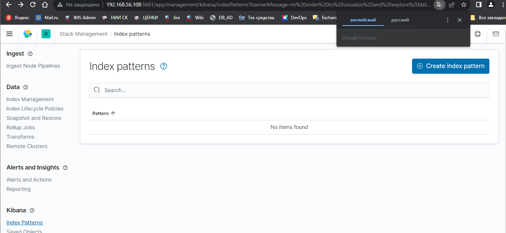

# Домашнее задание к занятию 11.3. «ELK» - Рыбакин Алексей

Подготовка:

Созданно на VirtualBox:
1. Debian11. В нём установлен apt-transport-https Elasticsearch 7.9.3 и Kibana 7.9.3 с настройками указанными ниже. ip 192.168.56.108
2. Debian11. Уустановленно apt-transport-https nginx и Logstash 7.9.3. ip 192.168.56.110


### Задание 1. Elasticsearch 

Установите и запустите Elasticsearch, после чего поменяйте параметр cluster_name на случайный. 

*Приведите скриншот команды 'curl -X GET 'localhost:9200/_cluster/health?pretty', сделанной на сервере с установленным Elasticsearch. Где будет виден нестандартный cluster_name*.


<details>
<summary>файл /etc/elasticsearch/elasticsearch.yml<</summary>
```
cluster.name: ARybakin-elastic
path.data: /var/lib/elasticsearch
path.logs: /var/log/elasticsearch
```
</details>

При всех этих настройках elastik вроде нормально выводит информацию.  
---

### Задание 2. Kibana

Установите и запустите Kibana.

*Приведите скриншот интерфейса Kibana на странице http://<ip вашего сервера>:5601/app/dev_tools#/console, где будет выполнен запрос GET /_cluster/health?pretty*.


<details>
<summary>файл /etc/kibana/kibana.yml </summary>

```
server.host: "0.0.0.0"
```
</details>
Так же и Kibana, при этих настройках выводит свою информацию.
И прокидывается на браузер Windows по адрессу 192.168.56.108:5601
---

### Задание 3. Logstash

Установите и запустите Logstash и Nginx. С помощью Logstash отправьте access-лог Nginx в Elasticsearch. 

*Приведите скриншот интерфейса Kibana, на котором видны логи Nginx.*

<details>
<summary>Файл /etc/logstash/conf.d/logstash.conf</summary>
```
input {
  file {
    path => "/var/log/nginx/access.log"
    start_position => "beginning"
  }
}

filter {
    grok {
        match => { "message" => "%{IPORHOST:remote_ip} - %{DATA:user_name} \[%{HTTPDATE:access_time}\] \"%{WORD:http_method} %{DATA:url} HTTP/%{NUMBER:http_version}\" %{NUMBER:response_code} %{NUMBER:body_sent_bytes}\"%{DATA:referrer>
    }
    mutate {
        remove_field => [ "host" ]
    }
}

output {
   elasticsearch {
     hosts => "192.168.56.108"
     data_stream => "true"
     index => "nginx-index"
   }
}
# блоки input и filter не правил. отсвил как есть.
```
</details>


Вывод логов в kibanu так не получилось


---

### Задание 4. Filebeat. 

Пока не дошёл. Решу logstash значит и этот решу 

Установите и запустите Filebeat. Переключите поставку логов Nginx с Logstash на Filebeat. 

*Приведите скриншот интерфейса Kibana, на котором видны логи Nginx, которые были отправлены через Filebeat.*

<details>
<summary></summary>
```
```
</details>
