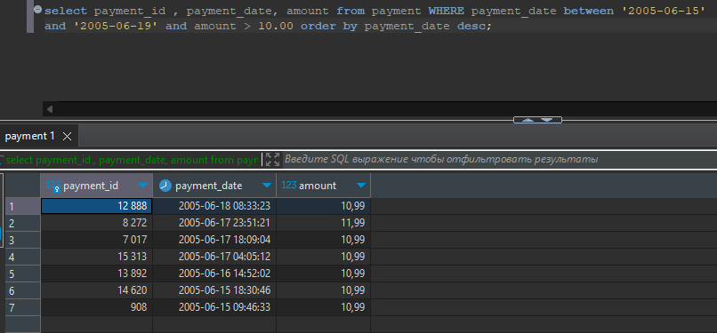

# Домашнее задание к занятию 12.3. «SQL. Часть 1» - Рыбакин Алексей

### Задание 1

Получите уникальные названия районов из таблицы с адресами, которые начинаются на “K” и заканчиваются на “a” и не содержат пробелов.

Ответ: SELECT distinct district from address where district like 'K%a' and district not like '% %';

### Задание 2

Получите из таблицы платежей за прокат фильмов информацию по платежам, которые выполнялись в промежуток с 15 июня 2005 года по 18 июня 2005 года **включительно** и стоимость которых превышает 10.00.

Ответ : 

select payment_id , payment_date, amount from payment WHERE payment_date between '2005-06-15' and '2005-06-19' and amount > 10.00 order by payment_date desc;

### Задание 3

Получите последние пять аренд фильмов.

Ответ : 

select payment_id , payment_date, amount from payment order by payment_id desc limit 5;

### Задание 4

Одним запросом получите активных покупателей, имена которых Kelly или Willie. 

Сформируйте вывод в результат таким образом:
- все буквы в фамилии и имени из верхнего регистра переведите в нижний регистр,
- замените буквы 'll' в именах на 'pp'.

Ответ : 

select LOWER (last_name) , LOWER(first_name) , LOWER (replace(first_name , 'LL' , 'pp')) 
from customer where first_name = 'kelly' or first_name = 'willie';

