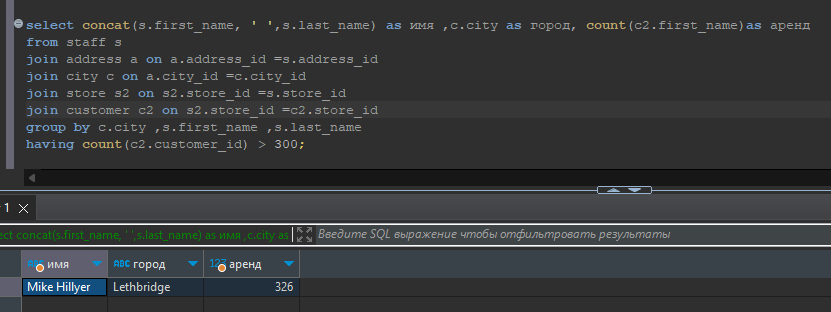

# Домашнее задание к занятию 12.4. «SQL. Часть 2» - Рыбакин Алексей

### Задание 1

Одним запросом получите информацию о магазине, в котором обслуживается более 300 покупателей, и выведите в результат следующую информацию: 
- фамилия и имя сотрудника из этого магазина;
- город нахождения магазина;
- количество пользователей, закреплённых в этом магазине.

Ответ :

select s.first_name,s.last_name,c.city, count(c2.first_name)

from staff s

join address a on a.address_id =s.address_id 

join city c on c.city_id =a.city_id

join customer c2 on c2.customer_id =c2.customer_id

group by c.city ,s.first_name ,s.last_name 

having count(c2.customer_id) > 300;

P.S. Как я понял по всей базе всего 2 магазина работают!

### Задание 2

Получите количество фильмов, продолжительность которых больше средней продолжительности всех фильмов.

Ответ :

select count('length') film_id 

from film f 

where length > (select avg(length) from film);

### Задание 3

Получите информацию, за какой месяц была получена наибольшая сумма платежей, и добавьте информацию по количеству аренд за этот месяц.

Ответ : 

select month (payment_date), count(payment_id), sum(amount) 

from payment 

group by month (payment_date) 

order by sum(amount) desc limit 1;

[Script](./Script/Script-12-4.sql)
