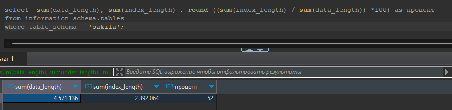
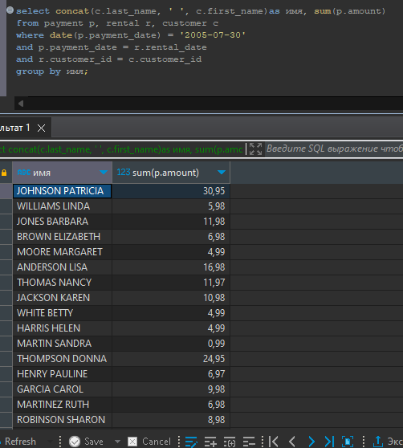
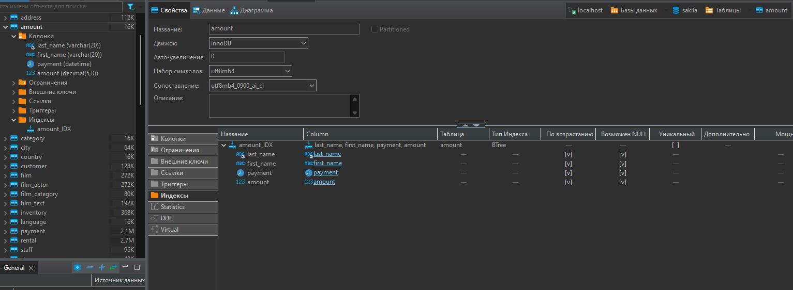

# Домашнее задание к занятию 12.5. «Индексы» -Рыбакин Алексей

### Задание 1

Напишите запрос к учебной базе данных, который вернёт процентное отношение общего размера всех индексов к общему размеру всех таблиц.

Ответ:

```sgl
select  sum(data_length), sum(index_length) , round ((sum(index_length) / sum(data_length)) *100) as процент
from information_schema.tables
where table_schema = 'sakila'
```



### Задание 2

Выполните explain analyze следующего запроса:

```sql
select distinct concat(c.last_name, ' ', c.first_name), sum(p.amount) over (partition by c.customer_id, f.title)
from payment p, rental r, customer c, inventory i, film f
where date(p.payment_date) = '2005-07-30' 
and p.payment_date = r.rental_date 
and r.customer_id = c.customer_id 
and i.inventory_id = r.inventory_id
```
- перечислите узкие места;
- оптимизируйте запрос: внесите корректировки по использованию операторов, при необходимости добавьте индексы.

Ответ:

По заданному скрипту нуджо показать плату каждого покупателя за 2005-07-30.

ТАКИМ скриптом с ЭТОЙ базой работает быстро.

```sql
select concat(c.last_name, ' ', c.first_name)as имя, sum(p.amount)
from payment p, rental r, customer c
where date(p.payment_date) = '2005-07-30' and p.payment_date = r.rental_date and r.customer_id = c.customer_id 
group by имя;
```



P.S. 
Но так как тема называется "Индексы" наверное подразумевается использовать их. Пока я этого не допонял.
Не понимаю какие столбцы прописать в новой таблице.

Вроде нужно указать те же столбцы, которые использованны в скрипте. Допустим Таблица 

create table amount (

last_name varchar(20),

first_name varchar(20),

payment datetime,

amount decimal(5.2)

);

Индекс создал через GUI



## Как заполнить мою новую таблицу - данными?
