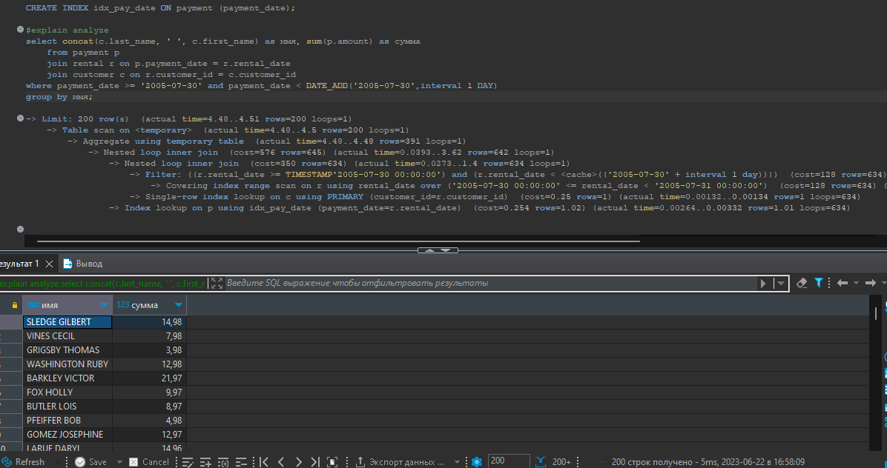

# Домашнее задание к занятию 12.5. «Индексы» -Рыбакин Алексей

### Задание 1

Напишите запрос к учебной базе данных, который вернёт процентное отношение общего размера всех индексов к общему размеру всех таблиц.

Ответ:

```sgl
select  sum(data_length), sum(index_length) , round ((sum(index_length) / sum(data_length)) *100) as процент
from information_schema.tables
where table_schema = 'sakila'
```


### Задание 2

Выполните explain analyze следующего запроса:

```sql
select distinct concat(c.last_name, ' ', c.first_name), sum(p.amount) over (partition by c.customer_id, f.title)
from payment p, rental r, customer c, inventory i, film f
where date(p.payment_date) = '2005-07-30' 
and p.payment_date = r.rental_date 
and r.customer_id = c.customer_id 
and i.inventory_id = r.inventory_id
```
- перечислите узкие места;
- оптимизируйте запрос: внесите корректировки по использованию операторов, при необходимости добавьте индексы.

Ответ:

```sql
CREATE INDEX idx_pay_date ON payment (payment_date);

explain analyze
select concat(c.last_name, ' ', c.first_name) as имя, sum(p.amount) as сумма 
    from payment p
    join rental r on p.payment_date = r.rental_date 
    join customer c on r.customer_id = c.customer_id 
where payment_date >= '2005-07-30' and payment_date < DATE_ADD('2005-07-30',interval 1 DAY)
```


