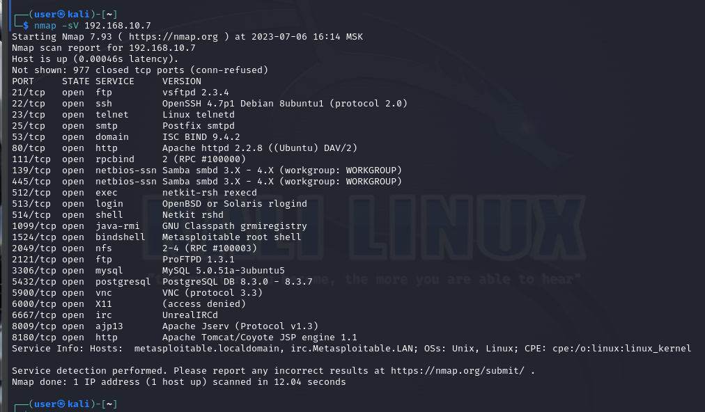

# Домашнее задание к занятию 13.1. «Уязвимости и атаки на информационные системы» - Рыбакин Алексей

### Задание 1
Скачайте и установите виртуальную машину Metasploitable: https://sourceforge.net/projects/metasploitable/.
Это типовая ОС для экспериментов в области информационной безопасности, с которой следует начать при анализе уязвимостей.
Просканируйте эту виртуальную машину, используя **nmap**.
Попробуйте найти уязвимости, которым подвержена эта виртуальная машина.
Сами уязвимости можно поискать на сайте https://www.exploit-db.com/.
Для этого нужно в поиске ввести название сетевой службы, обнаруженной на атакуемой машине, и выбрать подходящие по версии уязвимости.
Ответьте на следующие вопросы:
- Какие сетевые службы в ней разрешены?

nmap -sV 192.168.1.15

- Какие уязвимости были вами обнаружены? (список со ссылками: достаточно трёх уязвимостей)

https://www.exploit-db.com/exploits/17491

https://www.exploit-db.com/exploits/16922

https://www.exploit-db.com/exploits/43375

P.S. Не особо понял этот поиск. Ведь абсолютно точного попадания практически нет. А вот в каких погрешностях всё это расматривать. Остается вопрос. Хотя можно методом тыка конкретную уязвимость применить и тогда точно можно понять. Плюс давно не обновлялся этот metasploitable. Возможно информация устарела.

*Приведите ответ в свободной форме.* 

### Задание 2

Проведите сканирование Metasploitable в режимах SYN, FIN, Xmas, UDP.

Запишите сеансы сканирования в Wireshark.

Ответьте на следующие вопросы:

- Чем отличаются эти режимы сканирования с точки зрения сетевого трафика?

- Как отвечает сервер?

*Приведите ответ в свободной форме.*

сканирование SYN	-sS (scan SYN) - сканирует сеть TCP без подключения

сканирование FIN	-sA (scan FIN) - сканирует используя FIN-пакет

сканирование Xmas	-sX (scan Xmas) - сканирует в Xmas используя наборы флагов FIN|URG|PSH

сканирование UDP	-sU (scan UDP) - сканирует UDP-порты. При получении ответа ICMP, значит порт закрыт, а противном случае открыт.

При любом сканировании откравляется какой либо сигнал и ожидается ответ или без ответа. 
Во всех случаях сканирования открытые порты молчат. А от закрытых идет ответ. Так и определяют нужные порты для дальнейшей атаки.

