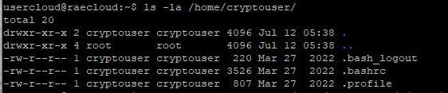
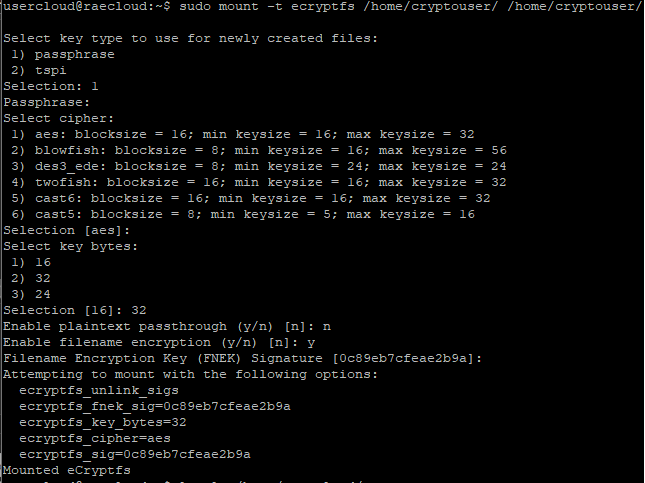
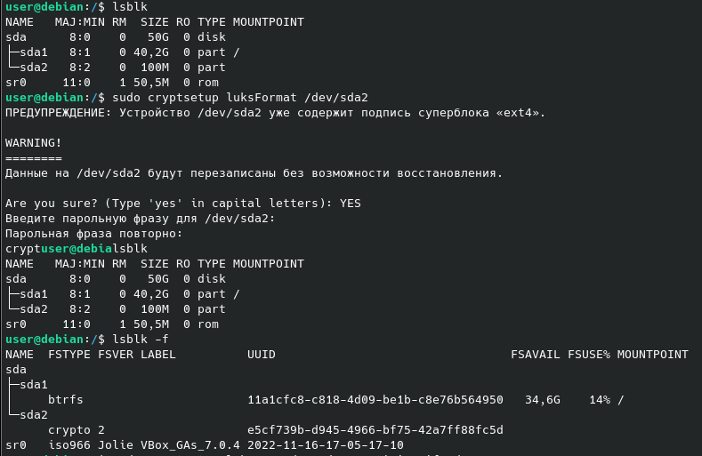

# Домашнее задание к занятию  «Защита хоста» - Рыбакин Алексей

### Задание 1

1. Установите **eCryptfs**.
2. Добавьте пользователя cryptouser.



<details>
<summary>3. Зашифруйте домашний каталог пользователя с помощью eCryptfs.</summary>

```sgl
sudo mount -t ecryptfs /home/cryptouser/ /home/cryptouser/
Select key type to use for newly created files:
 1) passphrase
 2) tspi
Selection: 1
Passphrase:
Select cipher:
 1) aes: blocksize = 16; min keysize = 16; max keysize = 32
 2) blowfish: blocksize = 8; min keysize = 16; max keysize = 56
 3) des3_ede: blocksize = 8; min keysize = 24; max keysize = 24
 4) twofish: blocksize = 16; min keysize = 16; max keysize = 32
 5) cast6: blocksize = 16; min keysize = 16; max keysize = 32
 6) cast5: blocksize = 8; min keysize = 5; max keysize = 16
Selection [aes]:
Select key bytes:
 1) 16
 2) 32
 3) 24
Selection [16]: 32
Enable plaintext passthrough (y/n) [n]: n
Enable filename encryption (y/n) [n]: y
Filename Encryption Key (FNEK) Signature [0c89eb7cfeae2b9a]:
Attempting to mount with the following options:
  ecryptfs_unlink_sigs
  ecryptfs_fnek_sig=0c89eb7cfeae2b9a
  ecryptfs_key_bytes=32
  ecryptfs_cipher=aes
  ecryptfs_sig=0c89eb7cfeae2b9a
Mounted eCryptfs
```

</details>




*В качестве ответа  пришлите снимки экрана домашнего каталога пользователя с исходными и зашифрованными данными.*  

### Задание 2

1. Установите поддержку **LUKS**.

<details>
<summary>2. Создайте небольшой раздел, например, 100 Мб.</summary>

```sgl
user@debian:/$ lsblk
NAME   MAJ:MIN RM  SIZE RO TYPE MOUNTPOINT
sda      8:0    0   50G  0 disk 
├─sda1   8:1    0 40,2G  0 part /
└─sda2   8:2    0  100M  0 part 
sr0     11:0    1 50,5M  0 rom  
```

</details>


<details>
<summary>3. Зашифруйте созданный раздел с помощью LUKS.</summary>

```sgl
user@debian:/$ sudo cryptsetup luksFormat /dev/sda2
ПРЕДУПРЕЖДЕНИЕ: Устройство /dev/sda2 уже содержит подпись суперблока «ext4».

WARNING!
========
Данные на /dev/sda2 будут перезаписаны без возможности восстановления.

Are you sure? (Type 'yes' in capital letters): YES
Введите парольную фразу для /dev/sda2: 
Парольная фраза повторно: 
```

</details>

*В качестве ответа пришлите снимки экрана с поэтапным выполнением задания.*




